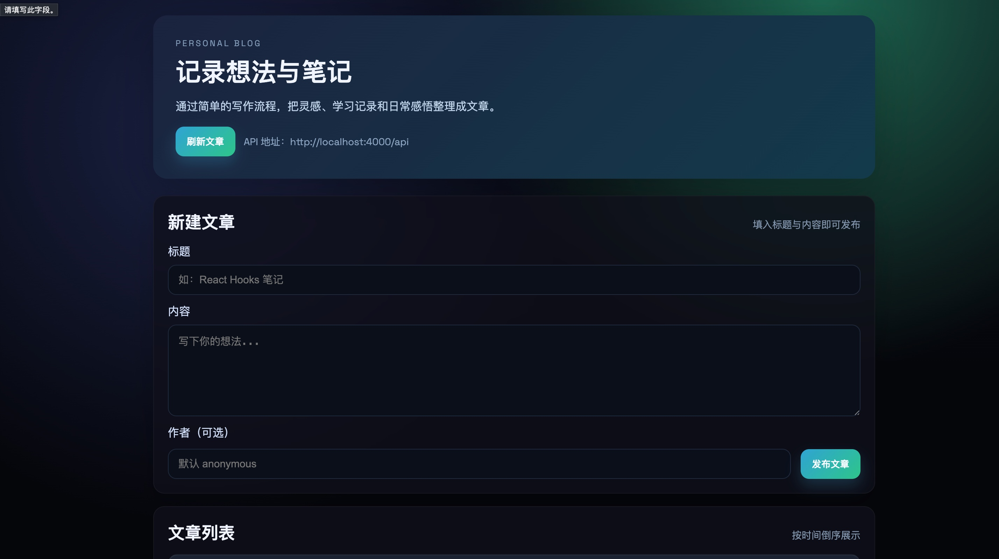

# React + Node.js 個人ブログ

React (Vite) フロントエンドと Express + MySQL バックエンドで構成したシンプルなブログ。バックエンドは投稿の CRUD を提供し、フロントで記事の作成と閲覧を行います。

## ディレクトリ構成

- `backend/`：Express API。`posts` テーブルは起動時に自動作成
- `client/`：React (Vite) フロントエンド

## 前提

- Node.js 18+
- ローカル MySQL（デフォルト DB は `blog_db` / `utf8mb4`。必要に応じ `.env` で変更）

## バックエンドの起動

```bash
cd backend
cp .env.example .env  # MySQL 接続情報に合わせて編集
# DB を新規作成する場合：
# mysql -u root -p -e "CREATE DATABASE blog_db CHARACTER SET utf8mb4;"
npm install
npm run dev   # 開発モード（ポート 4000）
# npm start   # 本番起動用
```

主な API:

- `GET /api/health` ヘルスチェック
- `GET /api/posts` 投稿一覧
- `GET /api/posts/:id` 投稿詳細
- `POST /api/posts` 投稿作成（`title`, `content`, `author?`）
- `PUT /api/posts/:id` 投稿更新
- `DELETE /api/posts/:id` 投稿削除

## フロントエンドの起動

```bash
cd client
cp .env.example .env  # API ベース URL を変える場合に編集
npm install
npm run dev  # デフォルト 5173 ポート
```

ブラウザで `http://localhost:5173` にアクセス。

## 備考

- 現在 `node_modules` は含めていません。ネットワークに接続して `npm install` を実行してください。
- `backend/src/db.js` は起動時に `posts` テーブルを自動生成します（データベース自体は事前に作成が必要）。

## 画面プレビュー


